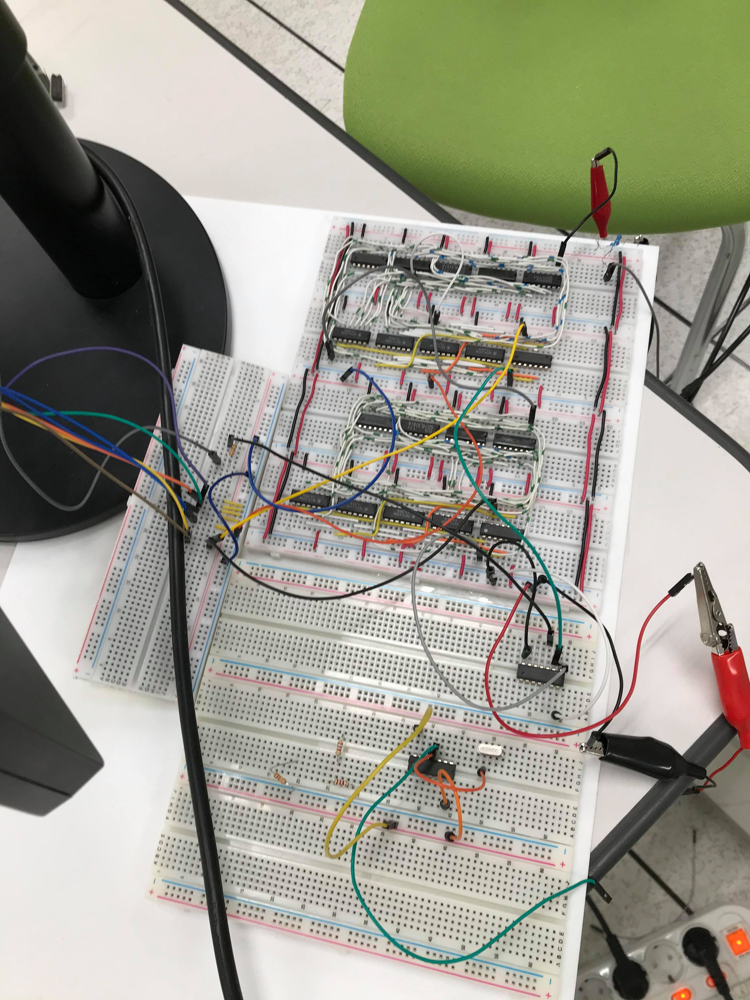
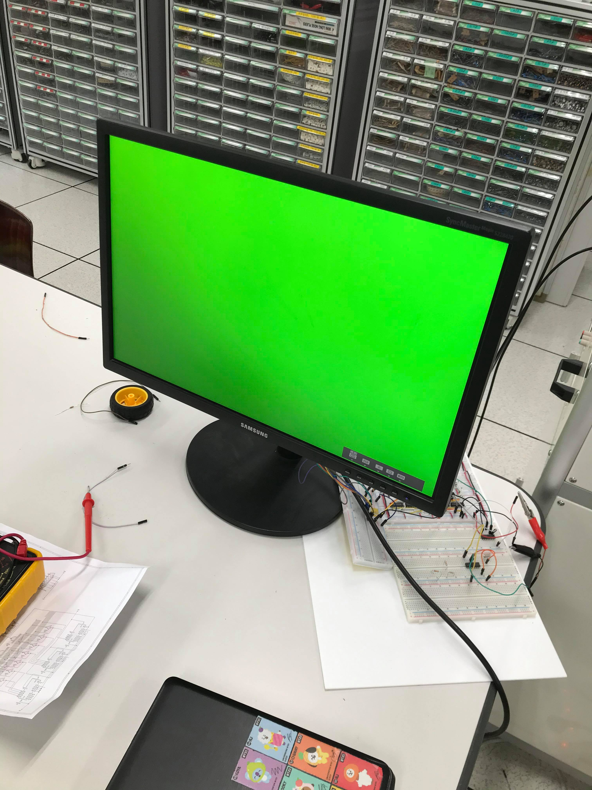

# Yuil-VGA
아두이노나 AVR같은 낮은 성능의 하드웨어 장치에서 비디오 출력을 가능하게 하고 논리회로의 이해도를 높이기 위하여 이 프로젝트를 진행함.

## 

  
  
  

## 진행 상황
7/6 프로젝트 시작

7/8 SYNC발생 회로 설계

7/13 SRAM 데이터 시트 해석

7/20 RAM 2개로 입출력이 동시에 가능한 회로 구상

8/3 부품 구입
  
8/8 SYNC회로 제작 시작

8/10 부품 추가 구입

8/18 SNYC발생 회로 완성

8/20 메모리 회로 제작 시작

8/22 ~ 9/6 방학으로 프로젝트 쉼

9/16 메모리 회로 제작중
  
## 앞으로...
메모리 회로 완성

MCU를 이용해 영상출력
